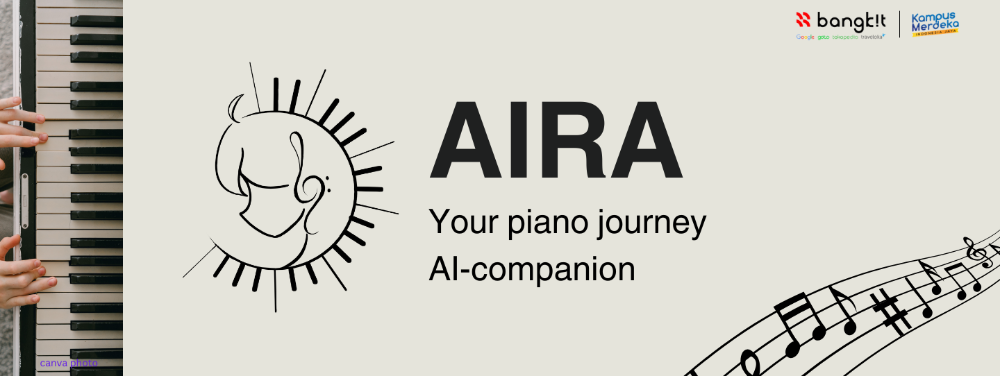

      

<h1 align="center">AIRA (C242-PS540)</h1>

<em>Your piano journey AI-companion</em>

About AIRA

AIRA is an AI-powered personal piano mentor designed to help self-learners overcome the challenges of recognizing and correcting mistakes during practice. Using machine learning technology, the app provides real-time, targeted feedback to enhance learning efficiency.

The app is capable of recognizing and evaluating pitch and rhythm accuracy on selected chord progressions, allowing users to focus their practice on areas that need improvement. Additionally, AIRA offers a gamified practice mode, where users can progressively build their skills, starting with simpler chords and advancing to more complex ones.

With AIRA, self-learners gain access to an affordable and accessible tool that enhances their learning experience, enabling them to practice and improve anytime, anywhere.

## Background
Learning how to play musical instruments is an excellent way to enhance cognitive skills and motoric abilities. Among musical instruments, the piano stands out as an ideal choice due to its versatility and relatively simple learning curve.

However, many beginner pianists often struggle to identify and correct mistakes, leading to slower progress and ingrained bad habits.

While professional lessons can address these challenges, they come with their own set of limitations. Yet, for many, professional piano lessons are impractical due to high costs and rigid schedules. Many learners struggle to find lessons that align with their schedule or budget.

## Team Member (C242-PS540)
| Bangkit ID | Name | Learning Path | University |Github |
| ---      | ---       | ---       | ---       | ---       |
| A464B4KY4588 | Zaebi Agustia Hidayatullah | Mobile Development| Universitas PGRI Ronggolawe | |
| M320B4KY0344 | Alexander Kent So | Machine Learning|	Universitas Surabaya  |  |
| M320B4KY1549 | Fransiscus Xaverius Petrus Jonathan Suhargo | Machine Learning| Universitas Surabaya|  |
| M320B4KY2099 | Joshua Daniel Talahatu | Machine Learning| Universitas Surabaya | |
| C406B4NY0117 | Aditya Widiyanto Nugroho | Cloud Computing | Politeknik Statistika STIS |  |
| C272B4KY2606 | Muh Rayhan Fahreza |  Cloud Computing | Universitas Muslim Indonesia | |

## Repository
 ### 📱 [Android Application Repository](https://github.com/TCHWG/Android-Development)
 The **Android Application** is the user-facing mobile app that provides an interactive piano learning experience with **real-time feedback**. It’s designed to   guide users through their learning journey, ensuring that each practice session is engaging and efficient.
   
 ### 🤖[Machine Learning Repository](https://github.com/TCHWG/Machine-Learning)
 The **Machine Learning** repository contains the AI models that power the feedback system. Using advanced machine learning techniques, it processes musical   input to provide real-time evaluations of pitch, rhythm, and chord progressions.
   
 ### ☁️[Cloud Computing Repository](https://github.com/TCHWG/Backend-AIRA)
 The **Cloud Computing/Backend** repository handles the backend infrastructure, including APIs for real-time feedback, user data management, and synchronization of progress across devices. It ensures that the app runs smoothly and the data is securely stored.